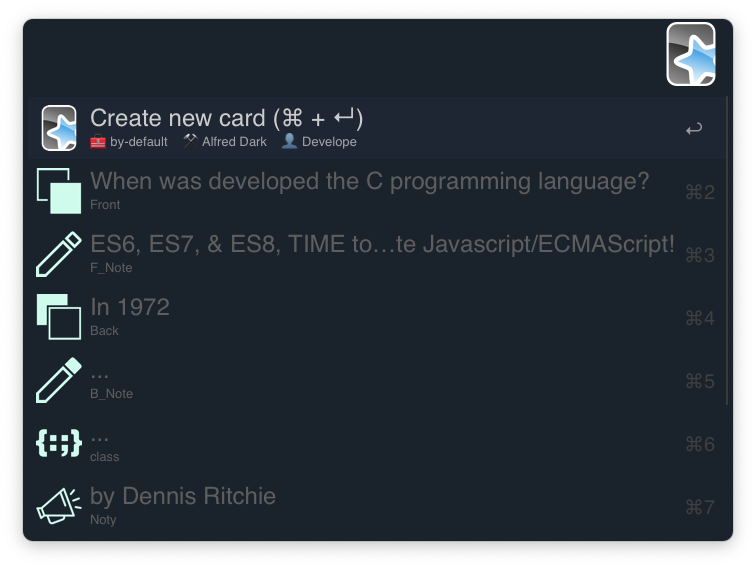
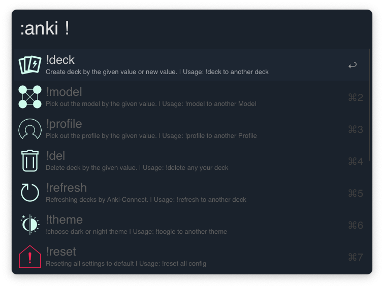

# alfred-anki [](https://travis-ci.org/bikenik/alfred-anki)

> anki card generator: Create New Cards into any Decks with any "Note Type".




## Install

```
$ npm install --global alfred-anki
```
or as [ `*.alfredworkflow`](https://github.com/bikenik/alfred-anki/releases)

*Requires: [Node.js](https://nodejs.org) 7.6+, Alfred [Powerpack](https://www.alfredapp.com/powerpack/), [Anki](https://apps.ankiweb.net) intelligent flash cards, [AnkiConnect](https://ankiweb.net/shared/info/2055492159) plugin for Anki*

>Also you can consider [DrLulz/Anki-Templates](https://github.com/DrLulz/Anki-Templates)


## Usage

- In Alfred, type `:anki`, 
- <kbd>Enter/Click</kbd> on the any field to fill it in 
- <kbd>Enter/Click</kbd> to save current value 
- the same staps to edit.
- type `:anki!`, to setting menu.

#### This workflow uses Markdown syntax: 
- [markdow-it](https://markdown-it.github.io) library with [Syntax highlighting (highlighjs.org)](https://highlightjs.org/),
- [\<ins> tag plugin for markdown-it](https://github.com/markdown-it/markdown-it-ins) `++inserted++ => <ins>inserted</ins>`,
- [\<mark> tag plugin for markdown-it](https://github.com/markdown-it/markdown-it-mark) `==marked== => <mark>inserted</mark>`

---
On the card fields:

- hit <kbd>⌃ + ↩</kbd> to remeber last input after created card.
- hit <kbd>⌃ + ↩</kbd> one more time to toggle switch this option
- hit <kbd>⌥ + ↩</kbd> to reset text from all fields
- hit <kbd>⇧</kbd>(shift) to preview parsed fields of card
- for line break type '\n' (with space or without), also should be handy to use 'Alfred's snippets'.

---
- To use your own icons for your Model's fields just you should call the `png` files the same as fields `[name-of-field].png` and put it into `icons` folder of this Workflow directory. Recommended use two instances of each icon where second icon (with some mark) will be called as `[name-of-field]_marked.png` for "remember last import" option.

## License

MIT © [bikenik](http://bikenik.org)
